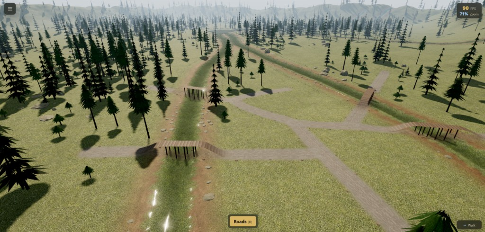

# City Builder Starter Kit - ThreeJS

A real-time Three.js sandbox for building a medieval settlement on a procedural 3D landscape. Draw dirt road networks across rolling hills, pine forests, and winding rivers — wooden bridges and graded ramps appear automatically when a path crosses water. Place lumber mills, woodcutter's lodges, reforesters, and stone quarries to harvest timber and stone, then lay out burgage residence zones along road frontage to grow your population. Assign workers from your labor pool to speed production; a server-side firewood supply chain routes timber from road-connected mills through lodges to homes that consume fuel each tick. A [SpacetimeDB](https://spacetimedb.com/) Rust module runs the authoritative economy simulation; the client renders replicated state in real time. Drop into first-person walk mode to explore on foot.



## Features

### Road building

- Interactive point-by-point road drawing projected onto a 3D terrain heightfield.
- Terrain projection so roads follow hills, slopes, and ground variation.
- Snapping to existing road nodes and road segments.
- Automatic edge splitting when new roads connect to existing segments.
- Wheel-adjusted curvature per segment (`Ctrl + scroll`), merged with automatic curve suggestions that route around building and residence footprints.
- Junction classification for endpoints, bends, T-junctions, cross-junctions, and complex junctions.
- Junction and endpoint cap meshes that blend road ribbons into clean intersections.
- Textured medieval dirt road materials with irregular blended shoulders.
- Live road preview while drawing, plus selection and delete with confirmation popup.
- Undo last placed point, undo last committed change, redo (`Ctrl+Y`), and full draft cancel.
- Terrain road-wear blending that tints grass to packed dirt along committed road corridors.
- Automatic river bridge generation when a road crosses water — graded approach ramps, elevated deck, and instanced support posts.
- Wood-log bridge deck material blended onto the road ribbon via a per-vertex `bridgeBlend` attribute.
- Bridge preview tint while drawing, plus placement validation that rejects spans wider than the max bridge length.
- Rock collision checks that block roads through scattered forest and river-shore boulders.
- Road-network connectivity for gameplay — buildings and residences must be within road-path distance for access, mill→lodge timber routing, and lodge→residence firewood delivery.

### Economy & settlement

- **Treasury & stockpile HUD** — per-player timber, stone, and firewood tracked in SpacetimeDB; live HUD also shows total population and free labor.
- **Shared game balance** — one `balance/gameBalance.json` source generates Rust constants and TypeScript bindings for costs, radii, tick intervals, and production rates.
- **Building placement costs** — timber and stone deducted from treasury on place; toolbar shows costs for the active build tool.
- **Building storage** — lumber mills, lodges, and quarries hold harvested resources in per-building inventory with capacity caps.
- **Salvage on demolish** — removing buildings or residence zones refunds ~70% timber and ~92% stone of placement cost, plus stored resources.
- **Labor assignment** — assign workers to production buildings via the inspector; labor speeds harvest cycles and is capped by available population.
- **Population pool** — starting population plus occupants from placed residences; unassigned workers form the free-labor pool shown in the HUD.
- **Lumber mill** — harvests the nearest mature tree within a 210 m work radius, stores timber in the building, and requires road access; up to 3 laborers scale the 9 s harvest cycle.
- **Reforester** — regrows stumps within a 190 m radius through `stump → growing → mature` phases; growing trees render as animated saplings; up to 1 laborer.
- **Stonecutter's camp** — extracts stone from the nearest procedural quarry site within 55 m every 9 s until depleted; stores stone in the building; up to 4 laborers.
- **Woodcutter's lodge** — processes stored timber into firewood on a 5 s cycle and delivers fuel along the road network to claimed residences; up to 2 laborers split between processing and delivery crews.
- **Road-based logistics** — Dijkstra road-path distance routes timber from mills to lodges and firewood from lodges to residences; nearest lodge claims each home on its road branch.
- **Tree lifecycle** — server-driven `mature → stump → growing → mature` phases with client visual sync (instanced forest, animated saplings, stumps).
- Server-authoritative simulation tick (200 ms) in the Rust module — buildings, trees, quarries, residence needs, and lodge delivery all run server-side.
- Building placement tool with terrain-following preview, flattened terrain pads, work-radius rings, and validation (water, slope, overlap, road access, trees, quarry stone).
- Building and residence demolish actions from the inspector panel.
- Click-to-inspect resource panel for quarries, buildings, residences, and river access — yields, storage, labor controls, firewood runway, and lodge delivery status.
- Quarry map icons projected on screen at zoomed-out camera levels; click an icon to inspect the site.
- Game state export/import (JSON v2) from the game menu for backups and sharing layouts offline (roads, buildings, trees, quarries, and treasury — residences are server-owned and not included in snapshots).

### Residences

- **Burgage zone placement** — draw a frontage edge along a road, then a depth point to define a rectangular plot subdivided into residence parcels.
- **Burgage layout HUD** — adjust plot count (+/−), rotate frontage edge (`F`), and see validity while placing.
- **Road frontage requirement** — zones must sit within frontage distance of the road network; parcels face the selected frontage edge.
- **Per-parcel costs** — each residence costs timber and stone on placement; narrow and wide parcels get 2 or 4 population respectively (default 3).
- **Procedural residence meshes** — timber-and-stone houses placed per parcel with instanced fence posts and rails along zone boundaries.
- **Firewood consumption** — residents burn firewood per person per tick; homes track stock and deficit timers server-side.
- **Abandonment** — prolonged firewood shortage abandons a residence (population drops to zero).
- **Residence inspector** — firewood stock, runway days, serving lodge, road access, and demolish options for a single home or entire zone.

### Exploration

- First-person walk mode with pointer-lock mouse look, spawned from the current orbit camera position.
- Terrain-following locomotion with sprint, jump, crouch toggle, and head-bob camera motion.
- Free-look while holding `Alt` — look around without turning the body; view recenters on release.
- Scrolling compass HUD with cardinal and intercardinal labels while walking.
- Seamless handoff between RTS orbit camera and walk mode via `~` (backtick).
- Walk locomotion samples road deck height so you can traverse built roads and bridges on foot.

### Landscape & environment

- Large procedural heightfield terrain with multi-layer value noise and broad macro shaping.
- TSL grass-blend terrain material mixing meadow, dense, and dry grass PBR texture sets.
- River-carved valleys with muddy shore blending where water meets land.
- Procedural river layout with multiple source corridors, tributaries, and a central confluence drain.
- Animated river water using a 2D virtual-pipes simulation with foam, shore lap, and alpha feathering.
- Organic river shore SDF fields for natural bank shapes and terrain mud tinting.
- Scatter-placed river shore stones along bank edges, with procedural shore-crossing gaps that clear stones for natural ford points.
- Instanced conifer forest with narrow, broad, and young tree forms plus scattered rocks and outcrops.
- Forest undergrowth — instanced bushes and ferns scattered in dense woodland pockets.
- Streamed 3D grass blade tufts with camera-relative LOD, zoom-gated reveal, and road clearance.
- Road-edge tree stumps placed along committed road corridors after tree clearance.
- River shore reeds clustered along bank edges for added shoreline detail.
- Trees automatically cleared along built roads; props respect river blocking zones.
- Procedural rock quarries (one large, two small) carved into the terrain with pit depressions, scattered boulders, and grass clearance pads.
- Animated volumetric-style sky and cloud dome with wind-driven motion.
- Directional sun lighting, exponential fog, soft shadow maps, and shadow bounds fitting.

### Rendering & UI

- WebGPU renderer preferred with automatic WebGL fallback.
- Dual post-processing pipeline: WebGL bloom + color grade, or WebGPU TSL bloom + daylight grade.
- Progressive loading screen with staged status labels while the world initializes.
- Contextual tip cards for camera, walk, and road modes — toggle off via the game menu.
- Game menu with persistent "turn off tips" preference stored in `localStorage`.
- Toast notifications for rejected road, building, and burgage placements (steep slope, river too wide, rocks in the way, insufficient resources, etc.).
- HUD with floating road/build tool buttons, live stockpile readout (timber, stone, firewood, population, labor), FPS and zoom readout, compass strip, burgage layout HUD, and building cost hints.
- Responsive full-screen canvas built with Vite, TypeScript, and Three.js r185.

## Controls

| Action | Control |
| --- | --- |
| Toggle road tool | `R` or click **Roads** |
| Place road point | Left-click on terrain |
| Undo last placed point while drawing | Right-click |
| Curve the road | Hold `Ctrl` and scroll the mouse wheel |
| Commit / build the road | Click the hammer icon or press `Enter` |
| Delete road segment | In road mode, hold `Alt` and left-click a segment |
| Confirm deletion | Click **Remove** in the popup |
| Undo last road change | `Ctrl+Z` / `Cmd+Z` |
| Redo last road change | `Ctrl+Y` / `Cmd+Y` |
| Cancel active road preview | `Escape` (road mode) |
| Toggle lumber mill placement | Click **Lumber mill** in the build toolbar |
| Toggle reforester placement | Click **Reforester** |
| Toggle woodcutter's lodge placement | Click **Woodcutter's lodge** |
| Toggle stonecutter's camp placement | Click **Stonecutter's camp** |
| Toggle burgage residence placement | Click **Residences** |
| Place building | Left-click on terrain (building tool active) |
| Place burgage zone | Click frontage edge, then depth point (residence tool active) |
| Adjust burgage plot count | `+` / `−` buttons in the burgage layout HUD |
| Rotate burgage frontage edge | `F` or click the frontage button in the burgage HUD |
| Inspect quarry / building / residence / river | Left-click on terrain (no tool active) |
| Assign labor to building | Inspector panel → labor `+` / `−` |
| Demolish building or residence | Inspector panel → **Remove** |
| Pan camera | Right-click drag, `WASD`, or arrow keys |
| Rotate camera | Middle-click drag or `Q` / `E` |
| Zoom camera | Mouse wheel |
| Toggle walk mode | Backtick (`~`) |
| Move (walk mode) | `WASD` or arrow keys |
| Sprint | `Shift` |
| Jump | `Space` |
| Crouch toggle | `C` |
| Free look (walk mode) | Hold `Alt` |
| Exit walk mode | `Escape` (walk mode) |
| Open game menu | Click the menu button (top-left) or `Escape` (RTS mode) |
| Export / import game state | Game menu → **Export game state** / **Import game state** |

## Quick Start

Install dependencies:

```bash
npm install
```

Run the development server (roads only — buildings and residences require SpacetimeDB):

```bash
npm run dev
```

Open the local URL printed by Vite, usually:

```text
http://localhost:5173/
```

Create a production build:

```bash
npm run build
```

Preview the production build:

```bash
npm run preview
```

## SpacetimeDB (authoritative backend)

This project uses [SpacetimeDB 2.0.1](https://spacetimedb.com/) for authoritative game state: treasury, buildings, trees, quarries, roads, burgage zones, residences, and the firewood supply chain. The client is a thin renderer — all economy simulation runs in the Rust module via a scheduled `tick_sim` reducer every 200 ms.

### Run locally

1. Start the SpacetimeDB standalone server (once per machine):

```bash
spacetime start
```

2. Publish the Rust module and regenerate TypeScript bindings:

```bash
npm run deploy:local
```

This runs `generate:world-bootstrap` (tree layout data for server bootstrap), `generate:game-balance` (shared economy constants), publishes the module to database `city-builder`, and writes TypeScript bindings to `src/generated/`.

To wipe and republish from scratch:

```bash
npm run deploy:local-clean
```

3. Start the Vite dev server:

```bash
npm run dev
```

The client connects to `http://localhost:3000` with database name `city-builder`.

### Anonymous identity

No login is required for local dev. On first visit the client generates a random token, stores it in `localStorage`, and reconnects with the same SpacetimeDB identity on refresh. Treasury, buildings, roads, and residences are scoped to that identity.

When real auth is added later, swap the token source in `src/network/identityPersistence.ts` — the connection layer stays the same.

### What syncs through the DB

| Data | Server table | Notes |
| --- | --- | --- |
| Timber / stone / firewood / water | `player_resources` | Per anonymous identity (treasury) |
| Lumber mill, reforester, lodge, stone quarry | `building` | Per-building storage, labor, cooldowns; server tick drives production |
| Tree stump / growing / mature | `tree_entity` | Bootstrapped after forest load |
| Quarry remaining yield | `quarry` | Global world sites (1 large + 2 small) |
| Roads + bridges | `road_network_state` | Full `RoadNetworkSnapshot` JSON per player |
| Burgage zone footprints | `burgage_zone` | Rectangular plot corners, frontage edge, plot count |
| Residence parcels | `residence` | Population, firewood stock, deficit ticks, abandoned flag |
| Sim tick counter | `world_config` | Monotonic server tick |

**Player reducers:** `place_building`, `demolish_building`, `assign_building_labor`, `place_burgage_zone`, `demolish_residence`, `demolish_burgage_zone`, `sync_road_network`, `remove_road_edge`. **Bootstrap reducers:** `bootstrap_quarries`, `bootstrap_trees`.

### Offline / disconnected behavior

- **Roads** — drawing, editing, and undo/redo work locally; changes queue and sync to SpacetimeDB when connected.
- **Buildings & economy** — require SpacetimeDB. If the server is offline, the client shows a toast and building or residence placement is blocked.
- **Export/import** — JSON game state snapshots (v2) can be saved and restored from the game menu regardless of server status (local client state for roads, buildings, trees, and treasury; residences live on the server and are not in export files).

## Project Structure

```text
src/
  app/        App bootstrap and frame loop
  buildings/  Building placement tool, meshes, markers, terrain pads, and validation
  camera/     RTS orbit camera, first-person controller, and locomotion helpers
  data/       SpacetimeDB game store (replicated state)
  generated/  SpacetimeDB TypeScript bindings and game-balance constants (auto-generated)
  grass/      Streamed 3D grass blade field and zoom LOD math
  input/      Keyboard and pointer state helpers
  logistics/  Client-side firewood runway and lodge delivery helpers
  map/        Screen-projected quarry map icons
  network/    SpacetimeDB client + anonymous identity persistence
  placement/  Spatial index for building, residence, and road footprint conflicts
  props/      Instanced forest, undergrowth, stumps, rocks, road clearance, shadow filters
  quarries/   Quarry site layout, terrain depression, and rock scatter
  residences/ Burgage zone tool, layout, meshes, fencing, and placement validation
  resources/  Game state, tree registry, world layout, resource inspector
  rivers/     River layout, field sampling, water sim, banks, reeds, and shore stones
  roads/      Road graph, drawing tool, mesh generation, junctions, bridges, connectivity
  runtime/    GameRuntime bridge (SpacetimeDB → App)
  scene/      Three.js scene, renderer backend, lighting, post-processing
  sky/        Animated sky/cloud mesh
  terrain/    Procedural heightfield, grass materials, road wear, ray projection
  ui/         Build toolbar, compass HUD, game menu, tip cards, toasts, loading screen
  utils/      Path geometry helpers and Three.js disposal
  world/      Precomputed world bootstrap data (tree positions for server seed)
balance/      Shared game-balance JSON (costs, radii, production, population)
server/       SpacetimeDB Rust module (authoritative sim tick, economy, logistics)
public/
  assets/     Terrain, road, prop, and third-party texture assets
scripts/
  derive_pbr_maps.py             Utility script for derived texture maps
  generate_wood_logs_texture.py  Procedural wood-log bridge albedo generator
  generateWorldBootstrap.mts     Generates tree bootstrap JSON for server publish
  generateGameBalance.mts         Generates Rust + TypeScript balance constants
  testLodgeLogistics.mts         Standalone firewood delivery logic validation
docs/
  screenshots/ Project screenshots used by this README
```

## How It Works

The terrain is generated as a continuous heightfield in `src/terrain/Terrain.ts`. It combines several value-noise layers with broad sine/cosine shaping, then uses vertex colors to blend grass tints and a shore-blend attribute for muddy river banks. `TerrainGrassMaterial.ts` builds a TSL node material that samples meadow, dense, and dry PBR sets per vertex.

`RiverLayout.ts` generates procedural river corridors from map edges toward a central drain, with optional tributaries. `RiverField.ts` rasterizes those corridors into mask and signed-distance fields used for terrain carving, shore mud blending, and prop blocking. `RiverWaterMesh.ts` runs a lightweight 2D virtual-pipes water simulation each frame and drives animated foam and shore effects through `RiverWaterMaterial.ts`.

`QuarryLayout.ts` places one large and two small rock quarries on the playable terrain, carving pit depressions into the heightfield and scattering instanced boulders via `QuarrySystem.ts`. Quarry yields and remaining stone are tracked server-side in the `quarry` table.

Road placement is handled by `src/roads/RoadTool.ts`. Pointer input is projected onto the terrain by `TerrainProjector`, collected as clicked road nodes with optional wheel-adjusted curvature merged with `roadAutoCurve.ts` suggestions around building and residence footprints, validated against slope and minimum length rules, and committed into a `RoadNetwork`.

`src/roads/RoadNetwork.ts` stores roads as nodes and edges. It resolves endpoint snapping, splits existing road segments when new paths connect into them, detects crossings, prunes orphan nodes, and classifies junction types.

`src/roads/RoadMeshBuilder.ts` turns road graph edges into terrain-following ribbon meshes. It samples Catmull-Rom curves, builds a core dirt ribbon, adds irregular blended shoulders, and keeps the road slightly above the terrain to avoid z-fighting. When a path crosses water, `RiverBridgeSpans.ts` detects wet runs, raises the deck above the water surface, and blends graded approach ramps; `BridgeSupports.ts` places instanced posts under the deck. `RoadJunctionBuilder.ts` adds endpoint caps and junction patch geometry at classified nodes.

`RoadPlacementValidation.ts` checks slope, minimum length, max bridge span, and rock collisions before commit. `RiverShoreCrossingGaps.ts` seeds procedural clearance zones along river banks so shore stones skip natural crossing points.

`src/props/ForestProps.ts`, `ForestUndergrowth.ts`, and `ForestManager.ts` scatter instanced conifer trees, bushes, ferns, and rocks across the playable area, skipping rivers and clearing trees near committed road edges. `RoadStumps.ts` places cut stumps along road shoulders after clearance. `RiverReeds.ts` adds instanced reed clusters along river banks. `ForestVisualSync.ts` mirrors server tree phases (`stump`, `growing`, `mature`) onto the instanced forest — growing trees swap to animated sapling meshes via `TreeSaplings.ts`.

`src/buildings/BuildingTool.ts` handles placement of lumber mills, reforesters, woodcutter's lodges, and stone quarries. `BuildingPlacementValidation.ts` rejects water, steep slopes, overlapping buildings, missing road access, and missing quarry stone or mature trees. `BuildingTerrainLayout.ts` flattens terrain pads under placed buildings. `BuildingMarkers.ts` renders placed buildings with work-radius rings. Placement calls the SpacetimeDB `place_building` reducer; the server tick then drives harvesting, regrowth, and lodge processing.

`src/residences/BurgageTool.ts` handles burgage zone drawing — a frontage edge snapped to the road network plus a depth point defining the rectangular plot. `burgageLayout.ts` subdivides the zone into residence parcels; `burgagePlacementValidation.ts` enforces road frontage, depth limits, overlap checks, and resource costs. `ResidenceMarkers.ts` and `BurgageFencing.ts` render procedural houses and parcel fencing. Placement calls `place_burgage_zone`; the server creates residence rows with population scaled by parcel width.

`src/logistics/` mirrors server firewood logic on the client for inspector displays — runway days, lodge delivery targets, and residence needs status. `src/roads/roadConnectivity.ts` and `server/src/roads/network.rs` compute Dijkstra road-path distances for building access and mill→lodge→residence routing.

`src/placement/` maintains a spatial index of building, burgage zone, and road footprints for fast overlap checks during placement and auto-curve obstacle queries.

`src/grass/GrassBladeField.ts` streams instanced 3D grass tufts in camera-relative chunks. Tufts fade in at close zoom (aligned with the terrain dirt LOD band) and are cleared near committed roads. `TerrainRoadWear.ts` updates a per-vertex `roadWearBlend` attribute so the TSL grass material tints to packed dirt along road corridors.

`src/data/spacetimeGameStore.ts` subscribes to replicated tables and maps rows into client `GameState`. `GameRuntime.ts` connects on startup, bootstraps quarries and trees via reducers, and hydrates the road network from the server snapshot.

On the server, `server/src/reducers/simulation.rs` runs each 200 ms tick: lumber mills harvest mature trees into building storage, reforesters advance stump regrowth, stone quarries extract from quarry sites, woodcutter's lodges process timber into firewood and dispatch delivery crews along the road graph (`lodge_logistics.rs`, `road_logistics.rs`), and residences consume firewood with abandonment on prolonged deficit (`residence_needs.rs`). Economy constants come from `balance/gameBalance.json` via `balance_generated.rs`.

`src/resources/ResourceInspector.ts` provides the stockpile HUD (timber, stone, firewood, population, labor) and click-to-inspect panel for quarries, buildings, residences, and river access — including labor assignment, demolish actions, and lodge delivery status. `WorldQueries.ts` resolves inspectable targets from terrain clicks. `src/map/QuarryMapIcons.ts` projects quarry icons at zoomed-out camera levels.

`src/camera/CameraController.ts` drives the RTS orbit camera with smooth pan, rotate, and zoom (displayed as a percentage in the HUD). `FirstPersonController.ts` handles walk mode — pointer-lock look, terrain- and road-deck-sampled foot placement, sprint/jump/crouch, free-look, camera bob, and compass heading publication.

`src/ui/BuildToolbar.ts` composes the HUD: tool buttons (roads, four building types, residences), burgage layout HUD, contextual tip cards, FPS/zoom stats, compass strip, delete popup, and game menu. `ToastManager.ts` surfaces placement validation errors. `LoadingScreen.ts` shows staged progress during world bootstrap.

`src/scene/SceneManager.ts` owns the renderer backend, terrain, sky, forest, grass field, river system, quarry system, road groups, selection/preview groups, lighting, fog, and post-processing. Forest and grass build asynchronously after the first frame to keep initial load responsive.

## Tech Stack

- TypeScript
- Vite
- Three.js r185 (WebGL + WebGPU)
- TSL node materials for terrain grass, road surfaces, and river water
- ACES tone mapping, soft shadows, bloom, fog, and custom daylight color grading
- [SpacetimeDB 2.0.1](https://spacetimedb.com/) — authoritative multiplayer backend
- Rust (WASM) server module compiled with `spacetime publish`

## Assets

Texture assets are stored under `public/assets/textures`. The road surface uses a medieval dirt texture set with albedo, normal, roughness, ambient occlusion, height, rut mask, and edge mask maps. River bridge decks use a separate wood-log PBR set (procedurally generated via `scripts/generate_wood_logs_texture.py`). Terrain uses multiple manor grass PBR sets (meadow, dense, dry, blend) and prop textures for pine foliage and rocks. Building meshes use procedural geometry with timber, stone, and shingle materials. Everything is loaded locally at runtime — no external asset CDN required.

## Development Notes

- Road editing works offline; buildings, residences, and economy require a running SpacetimeDB server (`spacetime start` + `npm run deploy:local`).
- `npm run build` runs TypeScript first, then Vite's production build.
- `npm run deploy:local` regenerates world bootstrap data and game-balance constants, publishes the Rust module, and refreshes `src/generated/` bindings — run this after any server schema, reducer, or balance change.
- `npm run generate:game-balance` regenerates `server/src/balance_generated.rs` and `src/generated/gameBalance.ts` from `balance/gameBalance.json`.
- `npm run test:lodge-logistics` runs a standalone script validating firewood delivery routing logic.
- WebGPU is attempted first; if initialization fails or the browser lacks support, the app falls back to WebGL automatically.
- A Vite chunk-size warning may appear because Three.js and post-processing code are bundled into the main client chunk. The build still completes successfully.
- Forest and grass vegetation build asynchronously after the first frame to keep initial load responsive.
- `window.__medievalGameState` exposes dev helpers for get/export/import state in the browser console.
- `dist/`, `node_modules/`, logs, and local editor files are ignored by Git.
